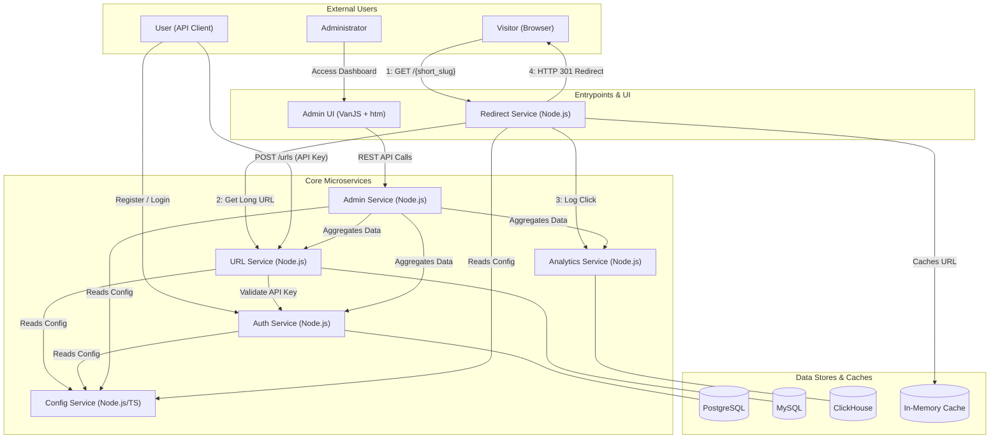

# microshort

A lightweight, containerized URL shortener platform built using modern microservices.

## Project Overview

The **microshort** system provides basic URL shortening capabilities as a modular, extensible platform. It includes services for URL creation, redirection, analytics, authentication, administration, and configuration management.

### Core Features

* Short URL creation with optional custom slugs
* Fast redirection handler
* Analytics tracking of clicks and referrers
* API key-based authentication
* Admin endpoints for link and user management
* Configuration service for shared system-wide settings

## Microservices Architecture



| Service           | Language             | Description                                                                                      |
| ----------------- | -------------------- | ------------------------------------------------------------------------------------------------ |
| config-service    | Node.js / TypeScript | Provides shared configuration settings (e.g., domain). Serves JSON-based config via REST.        |
| auth-service      | Node.js              | User authentication and API key management. PostgreSQL storage with JWT tokens.                  |
| url-service       | Node.js              | Handles URL shortening logic, slug generation, and storage in MySQL.                             |
| redirect-service  | Node.js              | High-performance redirect handler with caching. Public-facing service for short URLs.            |
| analytics-service | Java                 | Collects and processes click logs. Stores data in MongoDB and provides aggregated statistics.    |
| admin-service     | Node.js              | Administrative API aggregating data from all services. Ready for web UI integration.             |
| admin-ui          | VanJS + htm          | Web dashboard for system administration. Zero-build-tool approach with modern reactive UI.       |

## Request Flow Example

1. A user registers using `auth-service` and receives an API key
2. The user submits a long URL to `url-service` and gets back a short URL, such as `http://localhost:8080/abc123`
3. A visitor accesses the short URL via `redirect-service`, which:
   - Queries `url-service` for the long URL (with caching)
   - Returns a 301 redirect to the destination
   - Logs the visit for analytics
4. The redirect is logged by `analytics-service` (future)
5. Admins use `admin-service` to monitor the system:
   - View dashboard statistics
   - Manage users and URLs
   - Monitor service health
6. Access the web-based `admin-ui` at http://localhost:3004 for visual management

## Configuration

All services retrieve shared settings from the `config-service`. Services are configured using an environment variable:

```env
CONFIG_SERVICE_URL=http://config-service:3000
```

This ensures flexibility across environments and allows services to locate the domain name and other global parameters.

## Development Environment

* The project includes a `compose.yml` file to start all services
* Configuration values are loaded via a shared `.env` file
* Service discovery is handled by internal DNS in Docker or Kubernetes

## Quick Start

```bash
# Linux/Mac
chmod +x quickstart.sh
./quickstart.sh

# Windows PowerShell
.\quickstart.ps1

# Or manually:
docker compose up -d
```

The quickstart scripts will:
- Build and start all services
- Wait for services to be healthy
- Display service URLs
- Show example API commands

To stop services:
```bash
docker compose down
```

To view logs:
```bash
docker compose logs -f
```

## Services

### Config Service
- **Port**: 3000
- **Docs**: http://localhost:3000/docs
- **Purpose**: Provides shared configuration (domain, etc.)

### Auth Service
- **Port**: 3001
- **Purpose**: User registration, login, API key management
- **Storage**: PostgreSQL
- **Features**:
  - JWT-based authentication
  - API key generation with format: `msh_<32-char-nanoid>`
  - User management endpoints

### URL Service
- **Port**: 3002
- **Purpose**: URL shortening and management
- **Storage**: MySQL
- **Features**:
  - Create short URLs with random or custom slugs
  - Track click counts
  - API key validation via auth-service
  - Domain configuration from config-service

### Redirect Service
- **Port**: 8080
- **Purpose**: Public-facing redirect handler
- **Features**:
  - Fast redirects with in-memory caching
  - Home page at root domain
  - 404 handling for invalid URLs
  - No storage required - uses url-service API

### Admin Service
- **Port**: 3003
- **Purpose**: Administrative API for platform management
- **Features**:
  - Dashboard with system statistics
  - User and URL management
  - Service health monitoring
  - No direct DB access - uses microservice APIs
  - CORS-enabled for web UI

### Admin UI
- **Port**: 3004
- **Purpose**: Web-based admin dashboard
- **URL**: http://localhost:3004
- **Features**:
  - Built with VanJS + htm (no build tools)
  - Real-time service health monitoring
  - User and URL management interface
  - System configuration
  - Responsive design

## Testing

* Unit and integration tests for individual services
* Health check endpoints for container readiness
* Full workflow examples: `full-example.sh` and `full-example.ps1`
* Admin examples: `admin-example.sh` and `admin-example.ps1`

## Possible Future Features

* Web frontend for user interaction
* Notification hooks (e.g., Slack, email)
* Admin-editable configuration via the config-service

---

This project is designed as a practical platform to explore microservice architecture, DevOps workflows, and cloud deployment patterns.